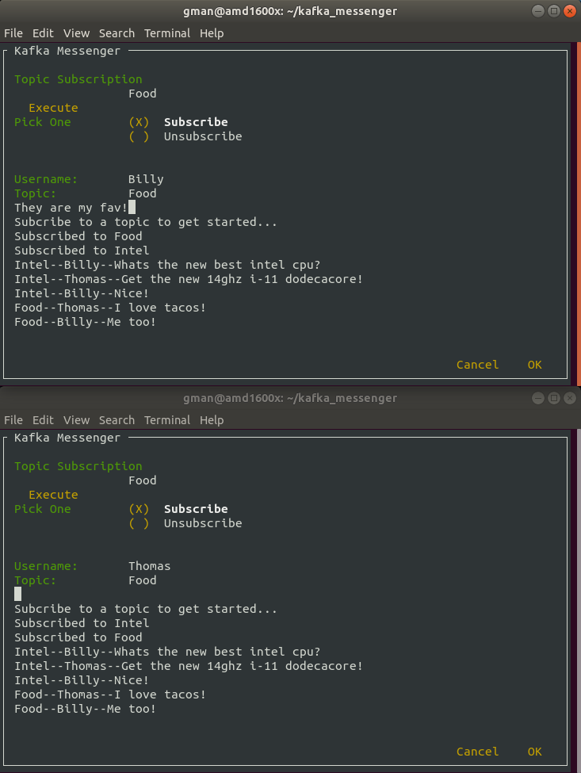

# kafka_messenger
A terrible idea to use kafka as a messaging service. 

This project is converting to a TUI project.

To Do...

Make this more accessible to just about anyone. I've had some decent success is test piloting it to a small group.

Find a way to stop spamming, or possibly just ingest messages faster. Right not we consume too slowly to handle a large amount of spam, but of course you could just change topic.

List the currently subscribed to topics. It would be nice to see what all topics I am subscribed to.

Direct messaging. This need some heavy design considerations. Since the consumer is fairly anonymous to the system overall, this is somewhat difficult but I'm sure it's possible. Maybe create a uuid per consumer, post it in the dialog, and have it make a topic and auto subscribe. Something like that.
